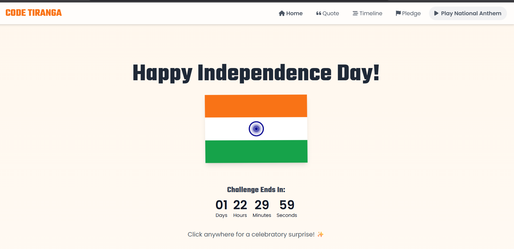
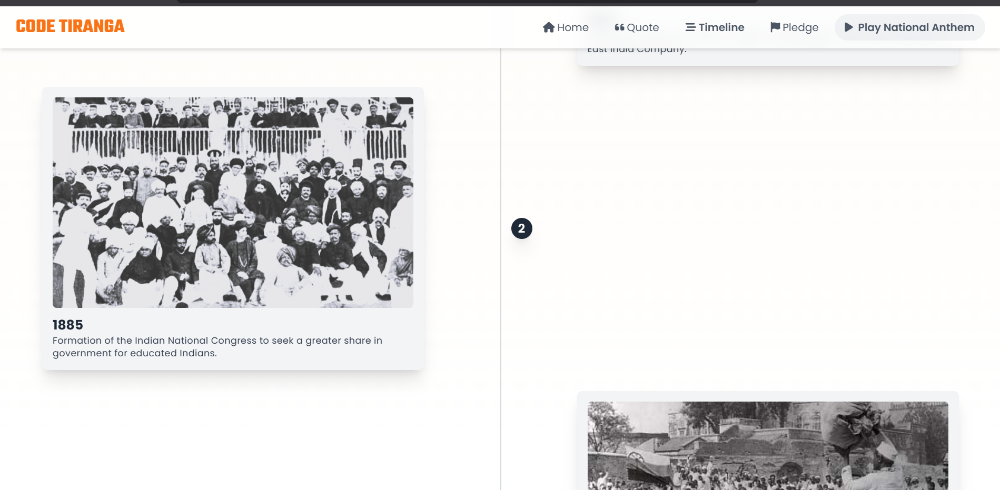
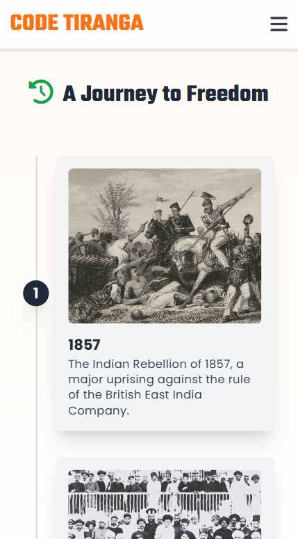
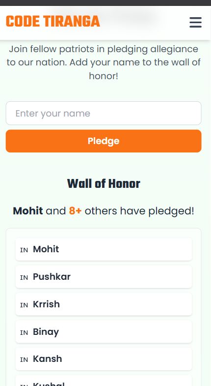

# Independence Day Webpage 🇮🇳  

🌐 **Live Demo:** [independence-dayacm.netlify.app](https://independence-dayacm.netlify.app/)  

This is a **mini Independence Day themed webpage** created as a project for the **Code Tiranga Challenge** organized by ACM Student Chapter.  

## Features  
- 🇮🇳 Animated Tricolor Flag  
- 📝 Patriotic Quote / Message  
- 📱 Responsive Design
- ⌛timeline section
- 🙋pledge section
- 🎆 Fireworks & Hover Effects (extra creativity)  

## Tech Stack  
- HTML  
- CSS  
- JavaScript  

## Glimpses for Desktop

  
  

## For Mobile Phone

  
  

